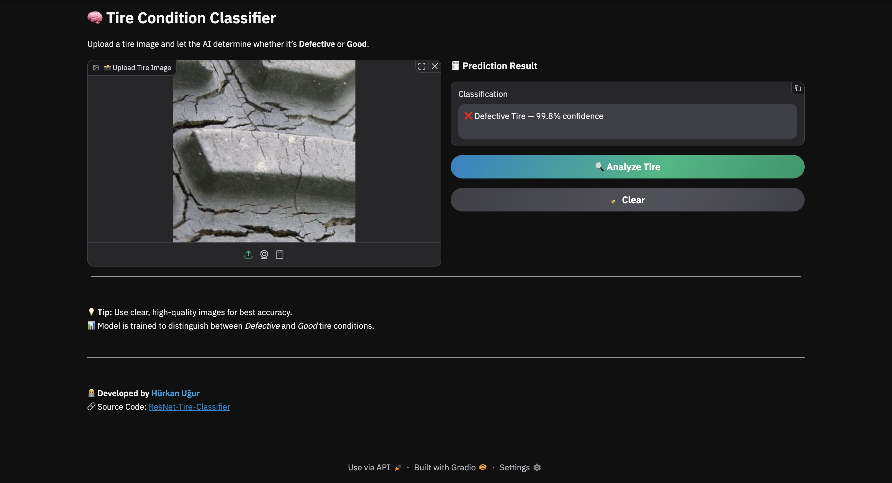

# 🛞 Tire Classification using Transfer Learning (ResNet50)

## 📖 Overview
This project predicts **tire classes** (e.g., damaged vs. normal) using **Transfer Learning** with a pretrained **ResNet50** architecture from **PyTorch**. It demonstrates a modern deep learning pipeline including:

- 🧠 **Pretrained ResNet50** backbone from ImageNet for feature extraction  
- 🧩 **Custom Fully Connected (FC) Classifier Head** with **Batch Normalization**, **ReLU**, and **Dropout**  
- ⚖️ **Cross-Entropy Loss** for binary classification  
- 🚀 **Adam optimizer** for efficient training  
- 🔒 **Frozen ResNet backbone** to leverage pre-learned visual features  
- 🧰 **Modular design** — easily switch between saving only the FC head or the full model
- 🎨 **Interactive Gradio Interface** for real-time image classification visualization

---

## 🖼️ Application Screenshot

Below is a preview of the **Gradio Interface** used for real-time classification:



---

## 🧩 Libraries
- **PyTorch** – model, training, and inference  
- **torchvision** – pretrained ResNet50 weights
- **pandas**, **numpy** – data handling
- **matplotlib** – loss visualization  
- **pickle** – saving/loading normalization params and trained model
- **Gradio** — interactive web interface for real-time model demos 

---

## ⚙️ Requirements

- Python **3.13+**
- Recommended editor: **VS Code**

---

## 📦 Installation

- Clone the repository
```bash
git clone https://github.com/hurkanugur/ResNet-Tire-Classifier.git
```

- Navigate to the `ResNet-Tire-Classifier` directory
```bash
cd ResNet-Tire-Classifier
```

- Install dependencies
```bash
pip install -r requirements.txt
```

---

## 🔧 Setup Python Environment in VS Code

1. `View → Command Palette → Python: Create Environment`  
2. Choose **Venv** and your **Python version**  
3. Select **requirements.txt** to install dependencies  
4. Click **OK**

---

## 🗂️ Download and Prepare Dataset

1. Download Dataset: 🔗 [Click here to download](https://drive.google.com/file/d/1_sR9tTuYAGgjiPNx9AelcsG8IStg6F1j/view?usp=sharing)
2. Unzip `data.zip` into the project directory
3. The `data` folder should be on the same hierarchy as `src` and `model`.

---

## 📂 Project Structure

```bash
assets/
└── app_screenshot.png                # Screenshot of the application

data/
├── defective                         # Defective tire images
└── good                              # Good tire images

src/
├── config.py                         # Paths, hyperparameters, split ratios
├── dataset.py                        # Data loading & preprocessing
├── device_manager.py                 # Selects and manages compute device
├── train.py                          # Training pipeline
├── inference.py                      # Inference pipeline
├── model.py                          # Neural network definition
└── visualize.py                      # Training/validation plots

main/
├── main_train.py                     # Entry point for training
└── main_inference.py                 # Entry point for inference

requirements.txt                      # Python dependencies
```

---

## 📂 Model Architecture

```bash
ResNet50 (Pretrained on ImageNet)
  ↓
[Feature Extractor]                   # All convolutional layers (frozen)
  ↓
Custom Classifier Head:
  → Linear(in_features, 1024)
  → BatchNorm1d(1024)
  → ReLU
  → Dropout(0.5)
  → Linear(1024, 2)
  → Softmax(Output)
```

---

## 📂 Train the Model
Navigate to the project directory:
```bash
cd ResNet-Tire-Classifier
```

Run the training script:
```bash
python -m main.main_train
```
or
```bash
python3 -m main.main_train
```

---

## 📂 Run Inference / Make Predictions
Navigate to the project directory:
```bash
cd ResNet-Tire-Classifier
```

Run the app:
```bash
python -m main.main_inference
```
or
```bash
python3 -m main.main_inference
```
